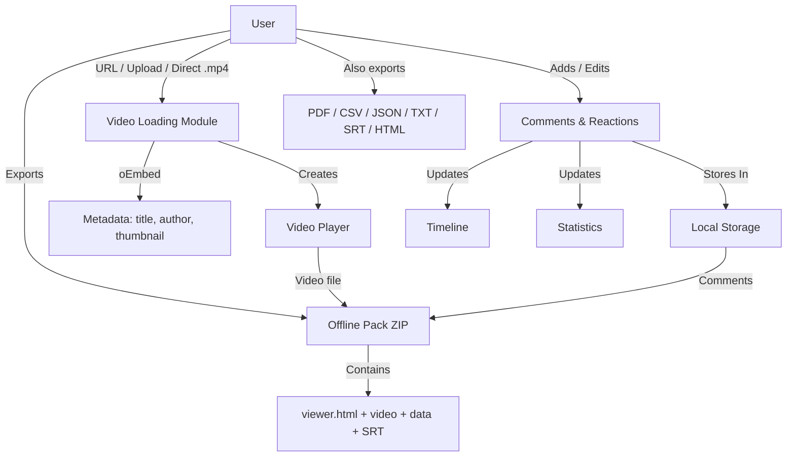

# 🎬 Vidlens: Video Reactions & Comments System

Vidlens (formerly ReactVid / VideoTAG) is a web application that lets you add timestamped reactions and comments to videos from many platforms — and take **everything offline** as a self-contained ZIP pack (video + comments + interactive viewer).

**Live app:** https://vidlens.net/ — see also [About](https://vidlens.net/about.html) · [How it works](https://vidlens.net/guide.html) · [FAQ](https://vidlens.net/faq.html)

## 📋 Table of Contents

- [Features](#-features)
- [Offline Pack](#-offline-pack-zip)
- [Supported Platforms](#-supported-platforms)
- [Architecture](#-architecture)
- [Installation](#-installation)
- [Usage](#-usage)
- [Keyboard Shortcuts](#-keyboard-shortcuts)
- [Export Options](#-export-options)
- [Technical Details](#-technical-details)
- [Contributing](#-contributing)
- [License](#-license)

## ✨ Features

- Add timestamped comments and emoji reactions to videos
- **Offline Pack export** — a ZIP with the video, all comments and a standalone offline viewer
- Support for YouTube, TikTok, Vimeo, Twitch, **direct .mp4/.webm links** and more
- Upload and comment on your own video files (up to 2 GB)
- Real video titles, authors and thumbnails fetched automatically (oEmbed)
- Edit and search comments; interactive timeline with clickable markers
- Recent videos list — jump back into any video with one click
- Live speech-to-text transcription or transcript import
- Comments exportable as **SRT subtitles** (overlay your notes on the video in VLC!)
- **"Include reactions" toggle** in the export menu — export text comments only, or even an empty pack (video + metadata)
- Keyboard shortcuts, drag & drop upload, analytics dashboard
- Zero build step, zero backend — everything runs and is stored in your browser

## 📦 Offline Pack (ZIP)

The flagship export. `Export → Offline Pack (ZIP)` produces a folder you can open **with no internet at all**:

| File | Purpose |
|------|---------|
| `viewer.html` | Interactive offline viewer — video + synced comments, search, filters, timeline |
| `video.mp4` / your file | **The actual video** (see below) |
| `data.json` | Complete machine-readable data (comments, transcript, metadata) |
| `comments.csv` / `comments.txt` | Spreadsheet & plain-text formats |
| `comments.srt` | Your comments as subtitles — load into VLC/mpv on top of the video |
| `transcript.srt` | Transcript (when available) |
| `thumbnail.jpg` | Video thumbnail (platform videos) |
| `README.md` | Pack contents & instructions |

**How the video gets into the pack:**

- **Local files** — bundled automatically.
- **Direct video URLs** (`.mp4`, `.webm`, …) — downloaded straight into the ZIP (when the host allows cross-origin downloads).
- **Streaming platforms (YouTube, TikTok, …)** — browsers cannot download their protected streams, and platform terms restrict it. At export time the app offers three ranked routes: **✅ the platform's own download/offline feature**, **⌨️ a prefilled `yt-dlp` command** (local open-source tool, no website involved — just copy &amp; run), or **🌐 a downloader site** (cobalt.tools) if you prefer not to install anything. Then **attach the file** and the MP4 ships inside the ZIP. Only save videos you have the right to download. You can also drop a `video.mp4` next to `viewer.html` later — the viewer finds it automatically, or loads any file via button/drag & drop.

## 🌐 Supported Platforms

| Platform     | URL Format Examples                                    | Embed | Video in ZIP |
|--------------|--------------------------------------------------------|:-----:|:------------:|
| YouTube      | `https://youtu.be/VIDEO_ID`                            | ✅    | attach/drop-in |
| YouTube Shorts | `https://youtube.com/shorts/VIDEO_ID`                | ✅    | attach/drop-in |
| TikTok       | `https://www.tiktok.com/@username/video/123456789`     | ✅    | attach/drop-in |
| Vimeo        | `https://vimeo.com/123456789`                          | ✅    | attach/drop-in |
| Dailymotion  | `https://www.dailymotion.com/video/x7yz1a2`            | ✅    | attach/drop-in |
| Twitch       | `https://www.twitch.tv/videos/123456789`               | ✅    | attach/drop-in |
| Facebook     | `https://www.facebook.com/watch/?v=123456789`          | ✅    | attach/drop-in |
| Instagram    | `https://www.instagram.com/p/abCD123EfGh/`             | ✅    | attach/drop-in |
| Odysee       | `https://odysee.com/@channel:4/video-name`             | ✅    | attach/drop-in |
| VK           | `https://vk.com/video-12345_67890`                     | ✅    | attach/drop-in |
| **Direct URL** | `https://example.com/video.mp4`                      | ✅    | ✅ automatic |
| Local Files  | Upload MP4, WebM, OGG, MOV (max 2 GB)                  | ✅    | ✅ automatic |

## 🏗 Architecture


```mermaid
flowchart TD
    A[User] -->|URL / Upload / Direct .mp4| B[Video Loading Module]
    B -->|Creates| C[Video Player]
    B -->|oEmbed| M[Metadata: title, author, thumbnail]

    A -->|Adds / Edits| D[Comments & Reactions]
    D -->|Stores In| E[Local Storage]

    D -->|Updates| F[Timeline]
    D -->|Updates| G[Statistics]

    A -->|Exports| H[Offline Pack ZIP]
    C -->|Video file| H
    E -->|Comments| H
    H -->|Contains| V[viewer.html + video + data + SRT]

    A -->|Also exports| I[PDF / CSV / JSON / TXT / SRT / HTML]
```

## 🚀 Installation

Vidlens is a browser-based application that doesn't require installation. Use the [live app](https://vidlens.net/) or run it locally:

```bash
git clone https://github.com/VideoTag/videotag.git
cd videotag
# Just open index.html in your browser
# (or serve it: npx serve — needed for some platform embeds)
```

## 🔍 Usage

### Adding a Video

1. Paste any video URL — the platform is auto-detected (including direct `.mp4` links)
2. Click **Load Video**

OR upload a local file: click **Upload File** or **drag & drop** a video anywhere on the input card.

### Adding Comments & Reactions

1. Use the quick reaction buttons below the video (👍, ❤️, 😂, …) or press keys `1`–`0`
2. Press `C` (or the ➕ button) for a text comment
3. Everything is timestamped at the current video position
4. Hover a comment to **edit** ✏️ or delete it; use the search box to filter

### Going Offline

1. `Export → Offline Pack (ZIP)`
2. For platform videos, optionally attach a video copy you have the rights to
3. Unzip anywhere and open `viewer.html` — no internet needed

## ⌨️ Keyboard Shortcuts

| Key | Action |
|-----|--------|
| `C` | Add comment at current time |
| `1`–`9`, `0` | Quick emoji reaction |
| `Space` | Play / pause (local & direct videos) |
| `←` / `→` | Seek ±5 s (local & direct videos) |
| `Ctrl`+`Enter` | Submit open modal |
| `Esc` | Close modal / dropdown |

## 💾 Export Options

| Format | Features                                                  | Best For                          |
|--------|-----------------------------------------------------------|-----------------------------------|
| **Offline Pack (ZIP)** | Video + viewer + all data formats in one folder | Offline review & archiving |
| HTML report | Self-contained page: notes + player, **load any local video file into it** (drag & drop), embeds local uploads | Sharing a reviewable report |
| PDF    | Formatted document with video information and comments     | Professional documentation        |
| CSV    | Plain data format, easily imported into spreadsheets       | Data analysis and processing      |
| JSON   | Complete structured data incl. transcript & metadata       | Programmatic use / backups        |
| Text   | Simple text file with timestamps and comments              | Simple review and sharing         |
| SRT    | Comments as subtitles                                      | Overlay notes on the video in VLC |

## 🔧 Technical Details

- **Languages:** HTML, CSS, JavaScript — no framework, no build step
- **Dependencies:**
  - JSZip (Offline Pack generation)
  - jsPDF (loaded on demand, only when exporting PDF)
  - YouTube iFrame / Vimeo Player APIs (progressive enhancement)
  - noembed.com oEmbed proxy (optional metadata; app works without it)
- **Storage:** localStorage — comments persist per video, including local files (stable content key)
- **Privacy:** no backend, no accounts, no tracking; your data never leaves the browser except the exports you download
- **Accessibility:** keyboard navigable, focus-visible outlines, `prefers-reduced-motion` support

## 🤝 Contributing

Contributions are welcome! Here are ways you can help:

1. **Bug Reports:** Open an issue describing the bug and steps to reproduce
2. **Feature Requests:** Suggest new features through issues
3. **Code Contributions:** Submit pull requests with improvements
4. **Documentation:** Help improve or translate the documentation

## 📄 License

This project is licensed under the MIT License - see the LICENSE file for details.

---

Made with ❤️ by [Gauthier BROS]
