# 🎬 VideoTAG: Video Reactions & Comments System

VideoTAG is a web application that allows users to add timestamped reactions and comments to videos from various platforms, creating an interactive viewing experience.


## 📋 Table of Contents

- [Features](#-features)
- [Supported Platforms](#-supported-platforms)
- [Architecture](#-architecture)
- [Installation](#-installation)
- [Usage](#-usage)
- [Export Options](#-export-options)
- [Timeline & Analytics](#-timeline--analytics)
- [Technical Details](#-technical-details)
- [Contributing](#-contributing)
- [License](#-license)

## ✨ Features

- Add timestamped comments and emoji reactions to videos
- Support for videos from multiple platforms including YouTube, TikTok, Vimeo, etc.
- Upload and comment on your own video files
- Interactive timeline with reaction/comment markers
- Analytics dashboard for comment and reaction statistics
- Export comments in various formats (CSV, Text, PDF, HTML)

## 🌐 Supported Platforms

| Platform     | URL Format Examples                                    | Embed Support |
|--------------|--------------------------------------------------------|:-------------:|
| YouTube      | `https://youtu.be/VIDEO_ID`                            | ✅            |
| TikTok       | `https://www.tiktok.com/@username/video/123456789`     | ✅            |
| Vimeo        | `https://vimeo.com/123456789`                          | ✅            |
| Dailymotion  | `https://www.dailymotion.com/video/x7yz1a2`            | ✅            |
| Twitch       | `https://www.twitch.tv/videos/123456789`               | ✅            |
| Facebook     | `https://www.facebook.com/watch/?v=123456789`          | ✅            |
| Instagram    | `https://www.instagram.com/p/abCD123EfGh/`             | ✅            |
| Odysee       | `https://odysee.com/@channel:4/video-name`             | ✅            |
| VK           | `https://vk.com/video-12345_67890`                     | ✅            |
| Local Files  | Upload MP4, WebM, OGG (max 100MB)                      | ✅            |

## 🏗 Architecture


## 🚀 Installation

VideoTAG is a browser-based application that doesn't require installation. Simply download the project files and open the `index.html` file in your web browser.

```bash
git clone https://github.com/yourusername/videotag.git
cd videotag
# Just open index.html in your browser
```

## 🔍 Usage

### Adding a Video

1. Select a video platform from the source selector
2. Enter the video URL in the input field
3. Click "Load Video"

OR

1. Select "Upload Video" from the source selector
2. Drag and drop a video file or click to browse
3. Click "Use Uploaded Video"

### Adding Comments & Reactions

Once a video is loaded:

1. Use the quick reaction buttons below the video (👍, ❤️, 😂, etc.)
2. Add text to your reaction when prompted
3. Comments and reactions are automatically timestamped at the current video position

### Using the Timeline

- The timeline shows the progress of the video
- Colored markers indicate comments (green) and reactions (yellow)
- Click on any marker to jump to that point in the video

## 📊 Timeline & Analytics

VideoTAG provides real-time analytics for your comments and reactions:


The statistics panel shows:
- Total number of comments
- Total number of reactions
- Average activity time
- Breakdown of reaction types

```mermaid
pie title "Reaction Distribution (Example)"
    "👍" : 45
    "❤️" : 30
    "😂" : 15
    "😮" : 5
    "Other" : 5
```




## 💾 Export Options

| Format | Features                                                  | Best For                          |
|--------|-----------------------------------------------------------|-----------------------------------|
| CSV    | Plain data format, easily imported into spreadsheets      | Data analysis and processing      |
| Text   | Simple text file with timestamps and comments             | Simple review and sharing         |
| PDF    | Formatted document with video information and comments    | Professional documentation        |
| HTML   | Interactive webpage with embedded video and comments      | Online sharing and presentation   |

## 🔧 Technical Details

- **Languages:** HTML, CSS, JavaScript
- **Dependencies:** 
  - YouTube iFrame API
  - jsPDF (for PDF generation)
  - JSZip (for combining HTML & video)
- **Storage:** Comments are stored in the browser's localStorage
- **Video Formats:** MP4, WebM, OGG (for uploaded videos)

## 🤝 Contributing

Contributions are welcome! Here are ways you can help:

1. **Bug Reports:** Open an issue describing the bug and steps to reproduce
2. **Feature Requests:** Suggest new features through issues
3. **Code Contributions:** Submit pull requests with improvements
4. **Documentation:** Help improve or translate the documentation

## 📄 License

This project is licensed under the MIT License - see the LICENSE file for details.

---

Made with ❤️ by [Gauthier BROS]
